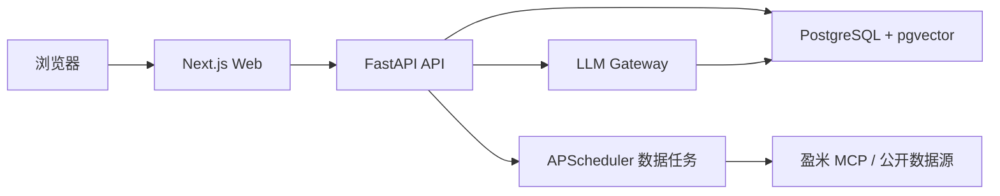

# 基金分析 Web 应用技术设计方案

文档版本：v1.0  
日期：2026-07-08  
应用定位：个人自用的基金分析与闲钱管理 Web 应用  
目标用户：基金投资新手、希望用规则化方式管理闲钱的个人用户  
默认工作目录：`C:\Users\39187\Desktop\基金`

## 1. 背景与目标

本应用基于两份输入材料整理而成：

- `个股分析软件功能需求.pdf`：提供投研工作台、GUI + LUI 双交互、行情/指标/资金/资讯/事件分析等扩展方向。
- `基金分析软件设计.pdf`：提供基金新手场景、合规约束、数据源策略、筛选比较、组合管理、回测学习等核心设计。

v1 明确以基金分析为主，不在首版实现个股投研主流程。个股相关能力只作为后续扩展点保留，例如行情模块、事件模块、资金流模块和语言交互入口。

### 1.1 产品目标

构建一个安静、专业、适合反复扫描的基金分析工作台，帮助用户完成以下闭环：

1. 通过风险测评理解自己的风险承受能力。
2. 基于合规历史净值和风险等级筛选基金。
3. 对最多 5 只基金做收益、风险、费用和基金经理维度对比。
4. 通过预设组合模板管理闲钱配置。
5. 用历史回测理解定投、再平衡等被动策略。
6. 通过 AI 分析助手解释指标、总结基金、诊断组合和辅助学习。

### 1.2 非目标

v1 不实现以下能力：

- 不提供基金实时估值。
- 不预测未来净值、未来收益率或短期买卖点。
- 不接入真实交易和自动下单。
- 不做 SaaS 多租户、计费、企业权限和复杂审计。
- 不以个股短线交易为主线。

### 1.3 合规原则

应用必须始终遵守以下边界：

- 所有分析页面显示数据来源、数据更新时间和免责声明。
- 基金风险等级必须与用户风险测评结果匹配。
- 超出风险承受能力的基金允许浏览，但必须触发明显风险提示，不进入推荐结果。
- 回测页面必须展示“历史表现不预示未来收益”。
- AI 助手输出必须说明“仅供分析学习，不构成投资建议”。

## 2. 技术栈

### 2.1 前端

| 分类 | 选型 | 用途 |
| --- | --- | --- |
| Web 框架 | Next.js 16 App Router | 页面路由、服务端渲染、静态资源和前端构建 |
| UI 框架 | React 19 | 组件化 UI |
| 类型系统 | TypeScript strict | 前端类型安全 |
| 样式 | Tailwind CSS v4 | 设计 token、响应式布局和组件样式 |
| 组件基础 | shadcn/ui | 基于 Radix 的无障碍组件基础 |
| 图标 | lucide-react | 按钮、导航、状态和工具图标 |
| 服务端状态 | TanStack Query | API 请求、缓存、重试和加载状态 |
| 表格 | TanStack Table | 基金列表、比较表和回测明细 |
| 图表 | Apache ECharts | 净值曲线、雷达图、热力图、环形图和回测曲线 |

### 2.2 后端

| 分类 | 选型 | 用途 |
| --- | --- | --- |
| API 框架 | FastAPI | REST API、OpenAPI、SSE 流式接口 |
| 数据校验 | Pydantic v2 | 请求、响应和配置校验 |
| ORM | SQLAlchemy 2 | 数据模型和查询 |
| 迁移 | Alembic | 数据库 schema 迁移 |
| 定时任务 | APScheduler | 个人部署下的数据同步任务 |
| 类型检查 | mypy | Python 类型检查 |
| 代码质量 | Ruff | Python lint 与 format |

### 2.3 数据与 AI

| 分类 | 选型 | 用途 |
| --- | --- | --- |
| 主数据库 | PostgreSQL 17 | 业务数据、基金数据、组合和回测记录 |
| 向量检索 | pgvector | 投教内容、指标解释和 AI RAG 检索 |
| JSON 存储 | PostgreSQL JSONB | 保存原始 API 响应和第三方数据快照 |
| AI 接口 | LLM Gateway | 统一封装 OpenAI-compatible provider |
| Embedding | Provider configurable | 文档切片和投教检索 |

### 2.4 部署

个人自用采用 Docker Compose，包含：

- `web`：Next.js 前端服务。
- `api`：FastAPI 后端服务。
- `postgres`：PostgreSQL + pgvector 数据库。

本地开发环境使用 Windows PowerShell。所有 npm 命令统一使用 `npm.cmd`，例如：

```powershell
npm.cmd run dev
npm.cmd run build
npm.cmd run test
```

## 3. 系统架构

### 3.1 总体架构



### 3.2 目录结构

```text
fund-web/
  apps/
    web/
      src/
        app/
        components/
        features/
        lib/
        styles/
    api/
      app/
        core/
        routers/
        services/
        repositories/
        schemas/
        models/
        jobs/
        tests/
      alembic/
  packages/
    contracts/
  docs/
    web应用技术设计方案.md
    api接口说明.md
    数据字典.md
```

### 3.3 前端分层

```text
src/app
  路由、布局和页面装配，只负责组合组件

src/features
  按业务域组织页面片段、hooks 和状态
  例如 funds、portfolio、backtest、assistant

src/components
  通用 UI 组件和领域组件

src/lib/api
  API client、OpenAPI 生成类型和请求封装

src/styles
  Tailwind token、主题变量和图表色板
```

页面不得直接调用 `fetch`。所有请求必须通过 `src/lib/api` 的 typed client。

### 3.4 后端分层

```text
routers
  路由层，只做鉴权、参数接收和响应封装

services
  业务逻辑层，例如基金筛选、组合诊断、回测、AI 编排

repositories
  数据访问层，封装 SQLAlchemy 查询

schemas
  Pydantic 请求和响应模型

models
  SQLAlchemy 数据模型

jobs
  数据同步、指标计算和补偿任务
```

路由层不得直接写 SQL，服务层不得直接拼 HTTP 响应。

## 4. 核心页面

### 4.1 `/dashboard`

个人首页，展示：

- 用户风险等级和有效期。
- 组合健康状态。
- 自选基金最新净值更新时间。
- 近期风险提示。
- AI 助手入口。

### 4.2 `/funds`

基金筛选主页面。桌面端采用三栏布局：

- 左侧：筛选条件和四步筛选器。
- 中间：基金列表。
- 右侧：选中基金详情摘要。

移动端改为：

- 顶部搜索。
- 筛选抽屉。
- 列表页。
- 独立详情页。

### 4.3 `/funds/[code]`

基金详情页，展示：

- 基金基础信息。
- 历史净值曲线。
- 收益、最大回撤、夏普比率、排名分位。
- 风险等级和风险匹配结果。
- 费用结构。
- 基金经理信息。
- AI “1 秒诊断”摘要。

### 4.4 `/compare`

基金比较页：

- 最多比较 5 只基金。
- 表格对比收益、风险、费用、经理经验。
- 雷达图展示收益、风险控制、费用友好度、经理稳定性。
- 支持从 `/funds` 列表加入比较。

### 4.5 `/portfolio`

组合管理页：

- 保守型、稳健型、进取型模板。
- 自定义组合持仓。
- 股债比例环形图。
- 组合收益曲线。
- 偏离阈值提示。
- 再平衡预览。

### 4.6 `/backtest`

回测学习页：

- 每月定投模板。
- 股债再平衡模板。
- 自定义起止时间、金额和频率。
- 组合与基准收益曲线。
- 年化收益、最大回撤、波动率等指标。
- 强制展示免责声明。

### 4.7 `/assistant`

AI 分析助手页：

- 自然语言筛选基金。
- 解释指标含义。
- 总结基金优劣势。
- 诊断组合风险。
- 解读回测结果。
- 回答投教问题。

所有回答都必须附：

- 使用的数据日期。
- 数据来源。
- 合规免责声明。
- 无法回答或数据不足时的明确说明。

### 4.8 `/learn`

投教学习页：

- 基金基础概念。
- 风险等级解释。
- 定投和再平衡说明。
- 指标解释。
- 常见误区。

### 4.9 `/settings`

设置页：

- 盈米 MCP 配置。
- LLM provider 配置。
- 数据源声明。
- 风险测评有效期。
- 本地数据清理。

## 5. 组件设计库

### 5.1 组件策略

项目使用 shadcn/ui 作为基础组件来源，但业务页面不得直接堆叠原始 shadcn 组件。必须通过项目自定义组件暴露统一样式和行为。

示例：

- 允许：`<RiskLevelBadge level="R3" />`
- 不建议：业务页面手写 `<Badge className="...">R3</Badge>`

### 5.2 通用组件

| 组件 | 用途 |
| --- | --- |
| `AppShell` | 顶部栏、侧边栏、主内容区和 AI 助手停靠入口 |
| `PageHeader` | 页面标题、说明、操作区 |
| `DataFreshnessBadge` | 数据来源和更新时间 |
| `ComplianceNotice` | 免责声明和风险提示 |
| `EmptyState` | 空结果、未配置数据源、无回测结果 |
| `ErrorState` | API 失败、数据源失败、AI 失败 |
| `LoadingBlock` | 页面和图表加载态 |
| `MetricExplainTooltip` | 指标解释 |

### 5.3 领域组件

| 组件 | 用途 |
| --- | --- |
| `FundSearchCombobox` | 按名称、代码搜索基金 |
| `FilterStepper` | 四步筛选框架 |
| `FundTable` | 基金列表 |
| `FundDetailPanel` | 列表右侧详情摘要 |
| `RiskLevelBadge` | R1-R5 风险等级 |
| `NetValueChart` | 净值曲线 |
| `RiskHeatmap` | 风险热力图 |
| `FundCompareRadar` | 基金雷达图 |
| `AllocationDonut` | 组合股债比例 |
| `BacktestResultPanel` | 回测结果展示 |
| `AssistantDock` | 页面右下或右侧 AI 助手入口 |

### 5.4 视觉规范

整体视觉方向为“安静、专业、可扫描”。避免营销页风格和大面积装饰。

关键规则：

- 卡片圆角不超过 `8px`。
- 页面区块采用全宽布局或无框布局，不做层层嵌套卡片。
- 表格、指标和图表保持紧凑，优先可读性。
- 按钮使用 lucide 图标和简短文案。
- 风险色统一使用 R1-R5 token。

风险色建议：

| 等级 | 语义 | 颜色 |
| --- | --- | --- |
| R1 | 低风险 | `#2E7D32` |
| R2 | 中低风险 | `#6A8F2A` |
| R3 | 中风险 | `#B58B00` |
| R4 | 中高风险 | `#C65D21` |
| R5 | 高风险 | `#B3261E` |

图表必须具备：

- loading 状态。
- empty 状态。
- error 状态。
- stale data 状态。
- 数据来源标注。

## 6. 核心业务规则

### 6.1 风险测评

用户首次使用必须完成风险测评：

- 题目数量：5-8 道。
- 输出结果：C1-C5。
- 有效期：12 个月。
- 到期前 30 天提醒重新测评。

匹配规则：

| 用户等级 | 可匹配基金 |
| --- | --- |
| C1 | R1 |
| C2 | R1-R2 |
| C3 | R1-R3 |
| C4 | R1-R4 |
| C5 | R1-R5 |

### 6.2 基金筛选

筛选采用四步框架：

1. 基础条件：成立年限、规模、基金类型、风险等级。
2. 核心指标：近 3 年和近 5 年收益、最大回撤、夏普比率。
3. 费用结构：申购费、管理费、托管费。
4. 基金经理：从业年限、管理同类基金年限、历史稳定性。

默认条件：

- 成立年限不少于 3 年。
- 基金规模建议 10-100 亿。
- 收益排名默认取同类前 30%。
- 最大回撤不高于同类平均。
- 夏普比率默认不低于 1.2。
- 管理费默认不高于 1.5%。

### 6.3 基金比较

比较规则：

- 最多比较 5 只基金。
- 超过 5 只时前端禁止继续添加。
- 比较维度固定为收益、风险、费用、基金经理、风险匹配。
- 风险超配基金必须在比较表中高亮。

### 6.4 组合管理

默认模板：

| 模板 | 股票/偏股基金 | 债券/货币基金 | 适用用户 |
| --- | --- | --- | --- |
| 保守型 | 20% | 80% | C1-C2 |
| 稳健型 | 50% | 50% | C2-C3 |
| 进取型 | 80% | 20% | C4-C5 |

再平衡规则：

- 任一资产类别偏离目标比例超过 `5%` 时，生成再平衡预览。
- 预览只展示“需要调回目标比例”的信息，不给出强制交易指令。
- 所有建议使用“可考虑”“用于恢复比例”这类非指令性表达。

### 6.5 回测

允许的策略：

- 每周定投。
- 每月定投。
- 固定比例再平衡。
- 模板组合回测。

禁止的策略：

- 未来收益预测。
- 短期买卖点推荐。
- 基于实时估值的套利策略。
- 自动交易策略。

## 7. API 设计

### 7.1 API 约定

统一前缀：`/api`

响应结构：

```json
{
  "data": {},
  "meta": {
    "source": "yingmi_mcp",
    "data_updated_at": "2026-07-08T20:30:00+08:00",
    "disclaimer": "本工具基于历史数据，仅供分析学习，不构成投资建议。"
  }
}
```

错误结构：

```json
{
  "error": {
    "code": "FUND_NOT_FOUND",
    "message": "未找到指定基金",
    "detail": {}
  }
}
```

### 7.2 基金接口

| 方法 | 路径 | 用途 |
| --- | --- | --- |
| GET | `/api/funds/search?q=` | 搜索基金 |
| GET | `/api/funds/{code}` | 基金详情 |
| GET | `/api/funds/{code}/nav?start=&end=` | 历史净值 |
| POST | `/api/funds/filter` | 条件筛选 |
| POST | `/api/funds/compare` | 基金比较 |

`POST /api/funds/filter` 请求示例：

```json
{
  "risk_profile": "C3",
  "fund_types": ["mixed", "bond"],
  "min_years": 3,
  "size_range": [10, 100],
  "return_rank_percentile": 30,
  "max_drawdown_lte_category_avg": true,
  "sharpe_gte": 1.2,
  "fee_lte": 1.5
}
```

### 7.3 风险测评接口

| 方法 | 路径 | 用途 |
| --- | --- | --- |
| POST | `/api/risk-assessments` | 提交风险测评 |
| GET | `/api/risk-assessments/latest` | 获取最新测评 |

### 7.4 组合接口

| 方法 | 路径 | 用途 |
| --- | --- | --- |
| GET | `/api/portfolios` | 获取组合列表 |
| POST | `/api/portfolios` | 创建组合 |
| GET | `/api/portfolios/{id}` | 组合详情 |
| POST | `/api/portfolios/{id}/rebalance-preview` | 再平衡预览 |

### 7.5 回测接口

| 方法 | 路径 | 用途 |
| --- | --- | --- |
| POST | `/api/backtests` | 创建回测 |
| GET | `/api/backtests/{id}` | 获取回测结果 |

### 7.6 AI 接口

| 方法 | 路径 | 用途 |
| --- | --- | --- |
| POST | `/api/ai/chat` | AI 对话，SSE 流式返回 |
| GET | `/api/ai/threads` | 对话列表 |
| GET | `/api/ai/threads/{id}` | 对话详情 |

`POST /api/ai/chat` 请求示例：

```json
{
  "thread_id": "optional-thread-id",
  "message": "帮我解释这只基金为什么最大回撤比较高",
  "context": {
    "fund_codes": ["000001"],
    "portfolio_id": null,
    "page": "fund_detail"
  }
}
```

AI 响应必须包含：

- 结论。
- 数据依据。
- 数据日期。
- 风险提示。
- 不足与限制。

## 8. 数据模型

### 8.1 核心表

| 表名 | 用途 |
| --- | --- |
| `funds` | 基金基础信息 |
| `fund_navs` | 基金历史净值 |
| `fund_metrics` | 收益、回撤、夏普、分位等指标 |
| `risk_assessments` | 用户风险测评结果 |
| `portfolios` | 组合基础信息 |
| `portfolio_positions` | 组合持仓 |
| `portfolio_snapshots` | 组合每日快照 |
| `backtest_runs` | 回测配置和结果 |
| `watchlists` | 自选基金 |
| `alerts` | 净值异动和风险提醒 |
| `ai_threads` | AI 对话线程 |
| `ai_messages` | AI 对话消息 |
| `documents` | 投教或说明文档 |
| `document_chunks` | 文档切片和向量 |
| `job_runs` | 数据任务运行记录 |

### 8.2 关键字段

`funds`：

- `code`
- `name`
- `fund_type`
- `risk_level`
- `manager_name`
- `inception_date`
- `fund_size_billion`
- `management_fee`
- `custody_fee`
- `source`
- `raw_payload`

`fund_navs`：

- `fund_code`
- `trade_date`
- `nav`
- `accumulated_nav`
- `daily_return`
- `source`
- `fetched_at`

`fund_metrics`：

- `fund_code`
- `period`
- `annualized_return`
- `max_drawdown`
- `volatility`
- `sharpe_ratio`
- `category_rank_percentile`
- `pe_pb_percentile`
- `calculated_at`

`risk_assessments`：

- `user_id`
- `risk_profile`
- `answers`
- `effective_from`
- `effective_to`

`backtest_runs`：

- `strategy_type`
- `config`
- `result`
- `benchmark_code`
- `created_at`

## 9. AI 分析助手设计

### 9.1 能力范围

v1 支持：

- 自然语言筛选基金。
- 基金指标解释。
- 基金优劣势摘要。
- 组合风险诊断。
- 回测结果解释。
- 投教问答。

v1 不支持：

- 自动下单。
- 未来收益预测。
- 明确买入、卖出、加仓、减仓指令。
- 绕过风险等级匹配。

### 9.2 LLM Gateway

后端只通过 `LLM Gateway` 调用模型，不允许业务服务直接调用 provider SDK。

接口职责：

- 注入系统提示词。
- 注入合规边界。
- 执行 RAG 检索。
- 记录输入输出。
- 屏蔽敏感配置。
- 统一错误处理。

### 9.3 RAG 数据来源

进入向量库的内容：

- 投教文章。
- 指标解释。
- 风险等级说明。
- 应用内合规声明。
- 用户已导入的基金说明材料。

不进入向量库的内容：

- API key。
- 用户密码。
- 未脱敏的敏感配置。

### 9.4 AI 输出模板

AI 对基金或组合的分析输出统一包含：

```text
结论摘要
数据依据
风险点
适合进一步查看的指标
数据日期
免责声明
```

## 10. 数据刷新与任务设计

### 10.1 任务列表

| 任务 | 频率 | 说明 |
| --- | --- | --- |
| `sync_fund_navs` | 交易日 15:30 后，20:30 补偿 | 获取历史净值 |
| `sync_fund_profiles` | 每日一次 | 更新基金基础信息 |
| `calculate_metrics` | 每日净值同步后 | 计算收益、回撤、夏普等 |
| `sync_risk_levels` | 每日一次 | 更新风险等级 |
| `refresh_embeddings` | 文档变化时 | 更新投教向量 |
| `cleanup_job_runs` | 每周一次 | 清理过旧任务记录 |

### 10.2 任务原则

- 任务必须幂等。
- 每次运行写入 `job_runs`。
- 数据源失败不覆盖已有数据。
- 前端必须可见数据过期状态。
- 数据同步失败时展示降级提示。

## 11. 代码规范

### 11.1 TypeScript 规范

- 开启 `strict`。
- 禁止业务代码使用 `any`。
- API 类型从 OpenAPI 生成，不手写重复类型。
- React 组件使用 PascalCase。
- hooks 使用 `useXxx`。
- 文件名使用 kebab-case。
- 页面组件只做装配，不写复杂业务逻辑。

推荐命名：

```text
fund-search-combobox.tsx
risk-level-badge.tsx
use-fund-filter.ts
funds-api.ts
```

### 11.2 Python 规范

- API 边界必须使用 Pydantic schema。
- SQLAlchemy model 不直接作为 API response。
- service 层不得返回 ORM 对象。
- repository 层只负责数据读写。
- 所有复杂计算必须有单元测试。
- 使用 Ruff format/lint。
- 使用 mypy 做类型检查。

### 11.3 CSS 与设计 token

- 业务颜色写入 theme token。
- 风险颜色集中维护。
- 图表色板集中维护。
- 不在页面内散落任意颜色值。
- 固定格式 UI 组件必须有稳定尺寸，避免 hover、加载或文本变化造成布局抖动。

### 11.4 合规文案

免责声明、风险提示、数据来源声明必须集中维护：

```text
src/lib/compliance/constants.ts
apps/api/app/core/compliance.py
```

业务页面只能引用，不得手写重复文案。

## 12. 测试计划

### 12.1 后端单元测试

必须覆盖：

- 收益率计算。
- 最大回撤计算。
- 夏普比率计算。
- 风险等级匹配。
- 再平衡偏离阈值。
- 定投回测。
- 数据同步幂等性。

### 12.2 API 测试

必须覆盖：

- 基金搜索。
- 基金详情。
- 基金筛选。
- 基金比较。
- 风险测评提交。
- 组合创建。
- 再平衡预览。
- 回测创建和查询。
- AI chat SSE 返回。
- 数据源失败降级。

### 12.3 前端测试

必须覆盖：

- 筛选流程。
- 最多 5 只基金比较。
- 风险测评。
- 组合模板套用。
- 回测结果展示。
- AI 诊断入口。
- 图表 loading、empty、error、stale 状态。

### 12.4 E2E 测试

Playwright 主路径：

1. 打开应用。
2. 完成风险测评。
3. 进入基金筛选页。
4. 筛选符合风险等级的基金。
5. 加入 2-5 只基金到比较页。
6. 创建一个稳健型组合。
7. 运行一次定投回测。
8. 打开 AI 助手解释回测结果。

### 12.5 视觉验收

桌面端和移动端都要检查：

- 文本不溢出。
- 图表非空。
- 风险颜色一致。
- 数据更新时间可见。
- 空状态和错误状态可理解。
- AI 助手不遮挡主要操作。

## 13. 开发里程碑

### 阶段 1：项目骨架与数据基础

目标周期：1-2 周

交付：

- Monorepo 初始化。
- Docker Compose。
- Next.js 基础布局。
- FastAPI 基础服务。
- PostgreSQL schema。
- 基金搜索和详情 API。
- 数据来源与更新时间展示。

### 阶段 2：筛选与比较

目标周期：2-3 周

交付：

- 四步筛选框架。
- 基金列表。
- 基金详情右侧面板。
- 最多 5 只基金比较。
- 雷达图和比较表。
- 指标解释 tooltip。

### 阶段 3：组合与风险

目标周期：3-4 周

交付：

- 风险测评。
- 组合模板。
- 组合持仓管理。
- 股债比例图。
- 再平衡预览。
- 风险匹配弹窗。

### 阶段 4：回测与 AI

目标周期：4-5 周

交付：

- 定投回测。
- 再平衡回测。
- 回测结果图表。
- LLM Gateway。
- AI chat SSE。
- 投教 RAG 检索。
- 基金和组合诊断。

## 14. 验收标准

v1 完成时必须满足：

- 用户可以完成风险测评并得到 C1-C5 结果。
- 用户可以按名称或代码搜索基金。
- 用户可以按四步框架筛选基金。
- 用户最多可以比较 5 只基金。
- 用户可以创建组合并查看比例偏离。
- 用户可以运行一次定投回测。
- AI 助手可以解释基金指标、组合风险和回测结果。
- 所有结果页面都显示数据来源、更新时间和免责声明。
- 超出风险等级的基金有明显提示。
- 前端和后端测试可以通过。
- Docker Compose 可以在个人电脑上启动完整服务。

## 15. 参考文档

官方技术文档：

- [Next.js Documentation](https://nextjs.org/docs)
- [React Documentation](https://react.dev)
- [Tailwind CSS Documentation](https://tailwindcss.com/docs)
- [shadcn/ui Documentation](https://ui.shadcn.com/docs)
- [FastAPI Documentation](https://fastapi.tiangolo.com)
- [SQLAlchemy Documentation](https://docs.sqlalchemy.org)
- [Alembic Documentation](https://alembic.sqlalchemy.org)
- [PostgreSQL Documentation](https://www.postgresql.org/docs/)
- [pgvector](https://github.com/pgvector/pgvector)
- [TanStack Query Documentation](https://tanstack.com/query/latest)
- [TanStack Table Documentation](https://tanstack.com/table/latest)
- [Apache ECharts Documentation](https://echarts.apache.org/handbook/en/get-started/)
- [Playwright Documentation](https://playwright.dev/docs/intro)

输入材料：

- `C:\Users\39187\Desktop\有空看\个股分析软件功能需求.pdf`
- `C:\Users\39187\Desktop\有空看\基金分析软件设计.pdf`

